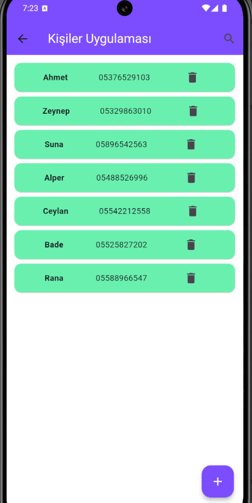
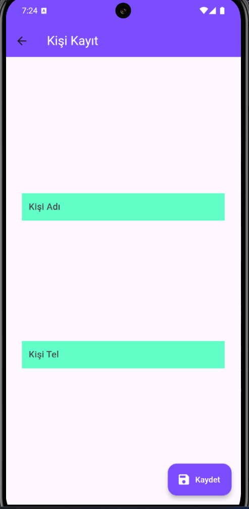
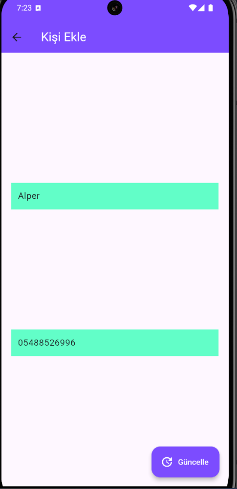

# KİŞİLER UYGULAMASI
<h2>SQLite ile Kişi Yönetimi Uygulaması</h2>

Bu uygulama, SQLite veritabanı kullanarak kişileri ekleyip, güncelleyip ve silebileceğiniz bir sistem sunmaktadır. Kullanıcılar, kişisel bilgilerini veritabanına kaydedebilir, mevcut bilgileri güncelleyebilir veya veritabanından silebilir. Uygulama, temel CRUD (Create, Read, Update, Delete) işlemlerini gerçekleştiren kullanıcı dostu bir arayüz sunmaktadır.

Veritabanı bağlantısı SQLite üzerinden yönetilmekte ve kullanıcılar veritabanı ile sorunsuz bir şekilde etkileşime geçebilmektedir.

    
    
    

